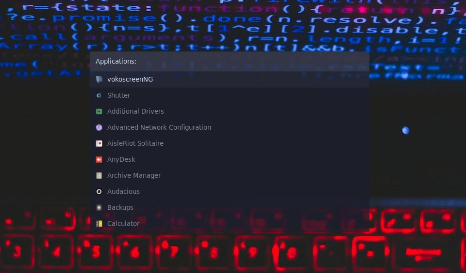

# rofi_in_ubuntu



### برنامه rofi خیلی شبیه به dmenu هست با این تفاوت که ظاهر خیلی زیباتری داره برای نصب کردن rofi تو اوبونتو اول از همه باید دستور پایین رو اجرا کنیم تا اون برای ما نصب بشه

```
sudo apt install rofi
```

### بعد از نصب کردن اون الان میتونیم از اون استفاده کنیم ولی ظاهر خیلی زیبایی نداره فعلا کافیه دستور پایین رو توی ترمنیال اجرا کنیم

```
rofi -show drun
```

### میبینیم که برای ما اجرا میشه ولی ظاهری خیلی خوبی نداره اگر بخوایم به لیست کامند هایی که میتونیم توی این محیط بزنیم دسترسی داشته بباشیم باید دستور زیر رو اجرا کنیم

```
rofi
```

### برای زیبا کردن محیط rofi توی محیط ubuntu اول از همه باید بریم توی ادرس پایین و rofi-emoji رو نصب کنیم که نیازمندی هاش رو گفته چیان

[install-rofi-emoji](https://github.com/Mange/rofi-emoji?tab=readme-ov-file#compile-from-source)

### بعد از نصب کردن دستور پایین رو توی ترمینال خودتون اجرا کنید

```
mkdir -p ~/.config/rofi
cd ~/.config/rofi
```

### حالا فایل config.rasi رو به اون مسیر انتقال بدین

```
mv config.rasi ~/.config/rofi/
```

### بعد از انجام دادن این کار کافیه برین توی ترمینال و دوباره دستور rofi -show drun رو اجرا کنید و با اون ظاهر خوشگلش رو به رو بشین

#### الان میریم به مسیر ~/.config/i3/config و یک shortcut برای اون میسازیم که از این به بعد به جای dmenu بیاد و rofi رو برای ما باز کنه

```
bindsym $mod+d exec rofi -show drun
```

## اضافه کردن emoji به rofi

### اگر بخوایم از emoji هایی که داریم توی ترمینالمون استفاده کنیم کافیه shortcut پایین رو به برنامه اضافه کنید و برین روی emoji مد نظرتون و enter رو بزنید که براتون کپی شه

```
bindsym $mod+shift+e exec rofi -show emoji
```

#### هشدار زمانی که این shortcut رو اضافه میکنید یک shortcut با مین کامند وجود داره که میتونید اون رو به ی چیز دیگه تغییر بدین یا ی shortcut دیگه ای برای این emoji ها در نظر بگیرید

## اضافه کردن ماشین حساب به rofi

### اگر بخوایم توی اوبونتو calc رو اضافه کنیم باید اول از همه galc رو نصب کنیم با دستور پایین

```
sudo apt install galc
```

### بعد از نصب کردن اون میریم به ادرس پایین و calc رو نصب میکنیم فقط دقت داشته باشین که توی قدم آخر به جای اجرای دستور make دستور sudo make install را اجرا کنید

[install-calc-for-rofi](https://github.com/svenstaro/rofi-calc?tab=readme-ov-file#from-source)

```
git clone https://github.com/svenstaro/rofi-calc.git
cd rofi-calc/
mkdir m4
autoreconf -i
mkdir build
cd build/
../configure
sudo make install
```

### بعد از این کافیه برین به آدرس پایین و calc رو هم اضافه کنید به کانفیگ خودتون توی فایل config.rasi

```
configuration {
    display-drun: "Applications:";
    display-window: "Windows:";
    drun-display-format: "{name}";
    font: "JetBrainsMono Nerd Font Medium 10";
    modi: "window,run,drun,emoji,calc"; // این خط کد رو باید تغییر بدین فقط

../
```

### بعد از انجام دادن این مراحل حالا میتونید که از ماشین حساب هم استفاده کنید کافیه با ctrl+shift بین تب های مختلف جابه جا بشین یا با زدن ctrl+shfit+tab برگردین عقب بین تب ها
